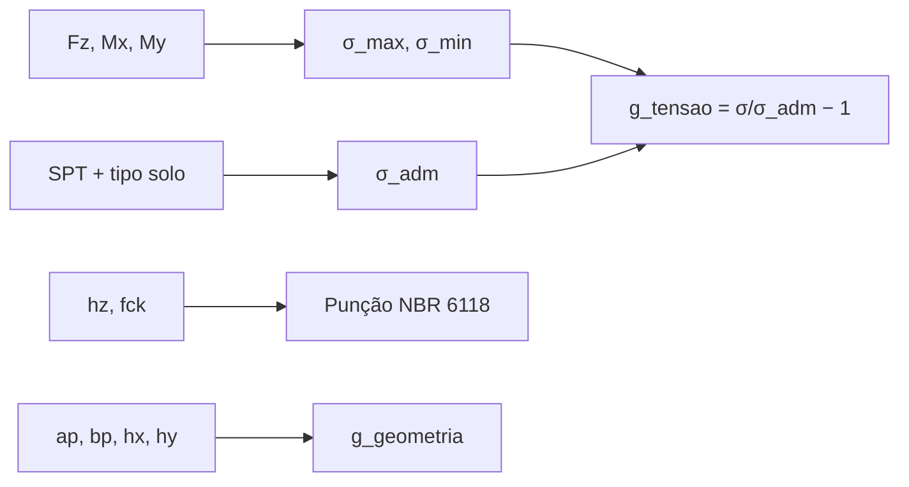

# 🏗️ MOC — Engenharia

Conceitos de mecânica das estruturas e geotecnia que sustentam as restrições do problema. Para criar um conceito novo use [[99_Templates/Template - Conceito]].

## Conceitos básicos

- [[02_Engenharia/Sapatas Isoladas]] — elemento estrutural otimizado
- [[02_Engenharia/SPT - Sondagem]] — input de campo (resistência do solo)
- [[02_Engenharia/Tensão Admissível do Solo]] — função de SPT e tipo de solo

## Restrições codificadas

- [[02_Engenharia/Flexão Composta - Sigma Max e Min]] — restrição `g_tensao`
- [[02_Engenharia/Verificação à Punção]] — restrição `g_puncao` (NBR 6118)
- [[02_Engenharia/Restrição de Geometria]] — restrição `g_geometria`

## Norma

- [[02_Engenharia/NBR 6118]] — projeto de estruturas de concreto

## Fluxo

Ver implementação em [[04_Codigo/fundacao.py]].
