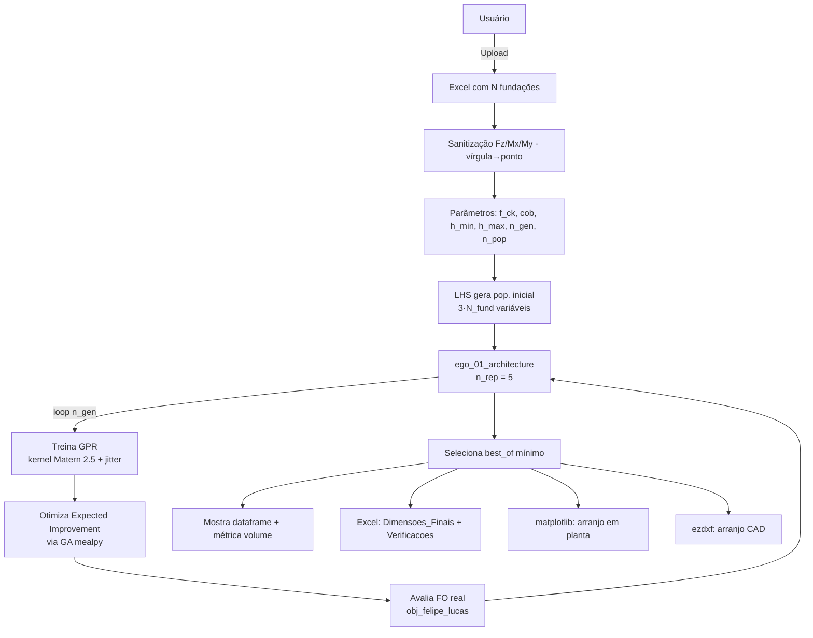

# Pipeline de Execução

Sequência completa quando o usuário clica em **Dimensionar** em [[04_Codigo/pages - sapatas.py]].

## Avaliação da FO (`obj_felipe_lucas`)

Para cada candidato `x = [hx_0, hy_0, hz_0, ..., hx_{N-1}, hy_{N-1}, hz_{N-1}]`:

1. Calcula **volume bruto** = `Σ hx·hy·hz`.
2. Calcula vértices das sapatas e **g_sobreposicao** (ver [[03_Otimizacao/Problema de Empacotamento]]).
3. Calcula **σ_adm** do solo (ver [[02_Engenharia/Tensão Admissível do Solo]]).
4. Para cada combinação `c1..cN`: calcula **g_punção** (ver [[02_Engenharia/Verificação à Punção]]) e **g_tensao** (ver [[02_Engenharia/Flexão Composta - Sigma Max e Min]]).
5. Calcula **g_geometria** (ver [[02_Engenharia/Restrição de Geometria]]).
6. **Volume final** = volume bruto + 10 × Σ max(g_k, 0).

Ver implementação detalhada em [[04_Codigo/fundacao.py]].

## Saídas

| Saída | Onde |
|---|---|
| Dimensões finais | `dados_final` DataFrame, sheet `Dimensoes_Finais` |
| Verificações detalhadas | `df_novo` DataFrame, sheet `Verificacoes_Detalhadas` |
| Volume mínimo | `best_of_aux` (m³) |
| Plot 2D | `st.pyplot(fig)` |
| Arquivo CAD | `arranjo_sapatas.dxf` |
