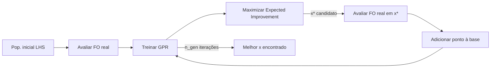

# EGO — Efficient Global Optimization

Método de **otimização global assistida por surrogate**. Inspiração: Jones, Schonlau, Welch (1998) "Efficient Global Optimization of Expensive Black-Box Functions".

## Esquema



## Implementação no projeto

`ego_01_architecture` em [[04_Codigo/metapy_toolbox - ego.py]]:

1. Avalia toda a população inicial (LHS).
2. Para `t in 1..n_gen`:
   - Treina pipeline `StandardScaler → GaussianProcessRegressor`.
   - Define EI (ver [[03_Otimizacao/Expected Improvement]]).
   - Otimiza EI com **mealpy GA** ou **scipy** (L-BFGS-B/SLSQP/TNC/trust-constr).
   - Adiciona o novo ponto e re-treina.
3. Retorna `best_x`, `best_of`, `df` completo.

## Configuração atual em `pages/sapatas.py`

```python
paras_opt    = {'optimizer algorithm': GA.BaseGA(epoch=50, pop_size=150)}
paras_kernel = {'kernel': constroi_kernel()[-1]}  # Matern ν=2.5
n_rep = 5
```

## Por que EGO aqui?

A FO `obj_felipe_lucas` é cara: cada avaliação roda múltiplos `df.apply` sobre todas as fundações × combinações. EGO **reduz o número de avaliações reais** ao guiar a busca pelo surrogate.

## Links

- [[03_Otimizacao/Gaussian Process Regressor]]
- [[03_Otimizacao/Expected Improvement]]
- [[03_Otimizacao/Algoritmo Genético]]
- [[03_Otimizacao/Latin Hypercube Sampling]]
- [[04_Codigo/metapy_toolbox - ego.py]]
